# 🌱 Multimodal Precision Agro-AI Decision & Farm Intelligence System

[](https://python.org)
[](https://streamlit.io)
[](https://fastapi.tiangolo.com)
[](backend/models)
[-blue.svg)](backend/data/knowledge)
[](backend/app/translations.py)

An end-to-end, reactive precision agriculture and multimodal farm intelligence platform built for Major Project Submission (A.Y. 2026–2027).

---

## 🏛️ System Architecture Flow

```mermaid
flowchart TD
    subgraph ClientLayer ["1. Ingestion Layer"]
        SoilCam["📷 Soil Photo Upload (JPG/PNG/WEBP)"]
        LabTest["🧪 Lab Soil Chemistry (N, P, K, pH, Zn, S, EC, Moist)"]
        IPGPS["📍 Client IP / GPS Geolocation Engine"]
        MeteoAPI["🛰️ Open-Meteo Satellite Weather Telemetry"]
    end

    subgraph StateLayer ["2. Unified Reactive Session State"]
        GlobalState["🔄 st.session_state (soil_data, selected_crop, sowing_date, city, lang)"]
    end

    subgraph AIEngines ["3. Multimodal AI & Computational Engines"]
        subgraph VisionEngine ["Vision & Domain Guard Pipeline"]
            FE133["133 Feature Extractor (RGB/HSV/LAB Moments + Histograms + GLCM Texture)"]
            OOD["OOD Domain Guard (Hue/Saturation/Dispersion Filters)"]
            SoilClassifier["Soil Classifier (LightGBM + Random Forest Ensemble)"]
            FE133 --> OOD
            OOD -->|Accepted Soil Image| SoilClassifier
            OOD -->|Rejected Non-Soil Image| OODAlert["OOD Rejection Alert"]
        end

        subgraph CropEngine ["30-Crop Precision Recommender"]
            FE15["15 Agronomic Feature Engineering Engine"]
            CropVoting["Voting Ensemble (XGBoost + LightGBM, 99.00% Acc)"]
            FE15 --> CropVoting
        end

        subgraph FertEngine ["Fertilizer Stoichiometry Engine"]
            TargetDB["ICAR 30-Crop Nutrient Uptake Target DB"]
            DeficitCalc["Deficit Calculation: ΔN, ΔP, ΔK (kg/ha)"]
            BagCalc["50-kg Commercial Bag Formulas (Urea, DAP, MOP, SSP)"]
            SplitRules["Split Fertigation Schedules & Micronutrient Alerts"]
            TargetDB --> DeficitCalc --> BagCalc --> SplitRules
        end

        subgraph PhenoEngine ["Dynamic Phenology Planner"]
            GrowthCalendar["Piecewise Phenological Functions + Calendar Anchoring"]
        end

        subgraph TelemetryEngine ["Meteorological Hazard Engine"]
            HazardRules["Extreme Weather & Pest Threshold Rules Engine"]
        end

        subgraph RAGEngine ["Agricultural RAG Chatbot"]
            IntentFilter["Dual-Path Intent Classifier (Greetings vs Technical Queries)"]
            DocIndex["67 ICAR & AgricultureGuruji Guides (343 Chunks)"]
            HybridRetriever["Hybrid BM25 + pgvector Semantic Retriever"]
            LLMGen["Gemini 1.5 Flash / Local Agronomic Synthesis"]
            IntentFilter -->|Technical Query| HybridRetriever
            DocIndex --> HybridRetriever
            HybridRetriever --> LLMGen
        end
    end

    subgraph PresentationLayer ["4. Streamlit Multilingual UI (EN, HI, TE, TA, MR, KN)"]
        TopBanners["🚨 Top-Level Proactive Hazard Alert Banners"]
        Tab1UI["📷 Tab 1: Soil Vision & Verified Lab Profile"]
        Tab2UI["🌾 Tab 2: 30-Crop Suitability Rankings & Selector"]
        Tab3UI["🧪 Tab 3: Crop Nutrient Target vs Supply & 50-kg Bag Plan"]
        Tab4UI["📅 Tab 4: Condensed Growth Progress Timeline"]
        Tab5UI["🤖 Tab 5: Multilingual Conversational AI Agronomist"]
    end

    SoilCam --> FE133
    SoilClassifier -->|Auto-Sync Soil Type & Baselines| GlobalState
    LabTest --> GlobalState
    IPGPS --> GlobalState
    MeteoAPI --> HazardRules
    MeteoAPI --> FE15

    GlobalState <--> Tab1UI
    GlobalState <--> Tab2UI
    GlobalState <--> Tab3UI
    GlobalState <--> Tab4UI
    GlobalState <--> Tab5UI

    GlobalState --> FE15
    GlobalState --> DeficitCalc
    GlobalState --> GrowthCalendar
    GlobalState --> LLMGen

    HazardRules --> TopBanners
    CropVoting --> Tab2UI
    BagCalc --> Tab3UI
    GrowthCalendar --> Tab4UI
    LLMGen --> Tab5UI
```



---

## 🌟 Key Capabilities & Module Specifications

### 1. 📷 Soil Vision & Out-of-Distribution (OOD) Guard
- **133 Visual Features Extracted:** 36 color moments across RGB, HSV, CIELAB; 64 color histogram bins; 33 GLCM texture metrics (Contrast, Dissimilarity, Homogeneity, Energy/ASM, Correlation, Entropy).
- **Domain Guard:** Filters out non-soil uploads (posters, dark studio backdrops, clown face paint, graphics) with **98.57% specificity**.
- **Auto-Sync:** Classifies 7 soil classes (*Black, Alluvial, Red, Laterite, Arid, Mountain, Yellow*) and updates regional agro-chemical baselines ($N, P, K, pH, \text{Zn}, \text{S}, \text{EC}$) globally across all tabs.

### 2. 🌾 Adaptive 30-Crop Precision Recommendation Engine
- **Features:** 15 engineered agronomic domain variables (NPK stoichiometric ratios, Temperature-Humidity Index, Moisture-Rainfall synergy, Nutrient Availability Score).
- **Classifier:** Soft-voting ensemble combining **XGBoost** and **LightGBM** delivering **99.00% cross-validated accuracy** across 30 crops.
- **Synced Selection:** One-click crop selection automatically propagates to Fertilizer, Lifecycle, and Chatbot modules.

### 3. 🧪 Quantitative Fertilizer Deficit & 50-kg Bag Calculator
- **Deterministic Stoichiometry:** Compares ICAR seasonal nutrient uptake targets against active soil supply ($\Delta N, \Delta P, \Delta K$).
- **Commercial Bag Output:** Computes exact 50-kg bags for **Urea (46% N)**, **DAP (18% N, 46% P₂O₅)**, **MOP (60% K₂O)**, and **SSP (16% P₂O₅, 11% S)**.
- **Stage-Wise Splits & Micronutrients:** Generates basal/tillering/flowering splits and corrects Zinc, Sulphur, Acidity (Lime), and Alkalinity (Gypsum).

### 4. 📅 Dynamic Calendar-Anchored Growth Timeline
- Automatically generates phenological stages, irrigation intervals, fertigation timings, and pest scouting windows anchored to the farmer's sowing date with a real-time progress bar.

### 5. 🚨 Proactive Real-Time Hazard Alert Banners
- Fetches live Open-Meteo satellite weather telemetry for the farmer's auto-detected GPS/IP location.
- Renders top-level alert banners for heavy rainstorm drainage hazards ($>15\text{ mm}$), thermal heatwaves ($>36^\circ\text{C}$), and high-humidity fungal epidemic windows.

### 6. 🤖 Conversational Multilingual RAG Agronomist
- **Knowledge Corpus:** 67 verified Markdown guides (343 chunks) from ICAR and *AgricultureGuruji*.
- **Intent Filter:** Handles conversational pleasantries ("hi", "hello", "namaste", "how are you") naturally without document dumping, while answering farming questions with scientific citations.
- **6 Indian Languages:** Native localization in **English, Hindi (हिन्दी), Telugu (తెలుగు), Tamil (தமிழ்), Marathi (मराठी), and Kannada (ಕನ್ನಡ)**.

---

## 📊 Empirical Benchmarks (5-Fold Stratified Cross-Validation)

### 🌾 Crop Recommendation Module (30 Crops)
| Rank | Model Architecture | Accuracy (%) | Macro Precision | Macro Recall | Macro F1 | Latency | Status |
| :---: | :--- | :---: | :---: | :---: | :---: | :---: | :--- |
| 🥇 | **Voting Ensemble (XGBoost + LightGBM)** | **99.00%** | **0.989** | **0.989** | **0.989** | **11.4 ms** | 🏆 **Deployed in Backend** |
| 🥈 | **LightGBM Classifier** | 98.60% | 0.985 | 0.985 | 0.985 | 6.1 ms | Regularized GBDT |
| 🥉 | **XGBoost Classifier** | 98.40% | 0.983 | 0.983 | 0.983 | 8.2 ms | $L_1/L_2$ Penalized |
| 4 | **Random Forest (100 Trees)** | 97.20% | 0.971 | 0.971 | 0.971 | 14.5 ms | Robust Bagging |
| 5 | **ExtraTrees (100 Trees)** | 96.80% | 0.967 | 0.968 | 0.967 | 12.1 ms | Random Splitter |
| 6 | **Decision Tree (CART)** | 88.40% | 0.881 | 0.882 | 0.881 | 1.2 ms | Baseline Tree |

---

## 🚀 How to Run the Application

### 1. Launch the Streamlit Multilingual Dashboard
```bash
streamlit run app.py
```
- Dashboard URL: `http://localhost:8501`

### 2. (Optional) Run the FastAPI REST Backend
```bash
uvicorn backend.app.main:app --reload --port 8000
```
- Interactive API Docs (Swagger UI): `http://localhost:8000/docs`

---

## 📄 Complete Implementation Research Paper
For the full mathematical formulations, dataset distributions, feature extraction equations, and agronomic citations, see **[`paper.md`](paper.md)**.
